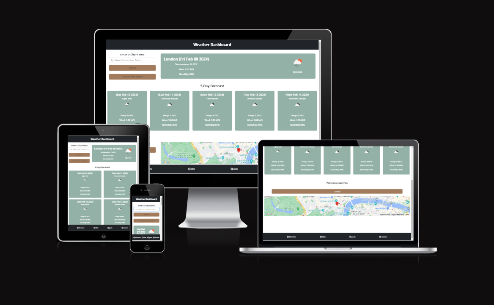

# Weather Or Not

Weather Or Not - Hackathon Project #2 - is a Front-end Web Application that provides Users with live weather data and forecast data. It demonstrates manipulating DOM elements with JSON from an open API, and fundamental Javascript that is used to add functionality to the site. In addition, it also utilises core Bootstrap, CSS, and HTML in regards to design and user experience.

# Contents

1. [UX Design](#ux-design)
2. [User Stories](#user-stories)
3. [Features](#features)
4. [Testing](#testing)
5. [Deployment](#deployment)
6. [Credits/Technologies Used](#credits)
7. [Future Features](#future-features)

## UX Design

### Home Page Wireframe Design

## User Stories

- As a User, I can search for the weather using a city name
  - There is a clearly visible search bar for the user to enter their desired city, and an assocaited search button. (They can also press enter to search)
- As a User, I can search for the weather using my current location
  - There is a "Use my location" button that will provide a pop up asking the user to allow the use of their devices geolocation
- As a User, I can see the forcasted weather for my searched city or my location for 5 days and the current day.
  - There is a section for each day with the relevant information displayed in a clear and concise manner.
- As a User, I will be able to explore and interactive map of the area of my choosing so that I can have an idea of what is in the area and have easy access to potential activities in the area
  - We have provided an interactive map from Google's map API that will change to the relevant city when a search is executed by the user, or the user's geolocation is used.

As can be seen from the project board, the sprint was composed of 14 separate items. Having used the MoSCoW approach to prioritisation, 8 were classified as "Must-Have" making up less than 60% of the tasks as recommended. The rest of the first sprint was made up of "Should-Have", "Nice to Have".

## Features

- **Search Bar**
The User can instead, enter their own custom location into the Input. Once they click search, the weather API will return weather data for that location.

- **User Location Button**
The User can click the current location button which uses the Geolocation API, the browser will then ask the User permission to access their device's location. Once that is accepted, the weather results shown will be for that location - using latitude and longitude of the User's device.

- **Live Weather**
When the User submits a search - current or custom location - the app will display a live weather container. This live weather will have key information about the location. This includes Temperature, Humidity, Wind Speed, Sunrise, Sunset and a description of the weather e.g Cloudy.

- **Five Day Forecast**
In addition to live weather, the User will receive Forecasted Weather for that location. It will provide the User with the next 6 days of weather information - combined with live weather, totals to 7 day weather data. The Forecasted Weather prediction will have minimal but crucial information - date, temperature and weather description.

- **Previous Searches**
As an extra feature, previous searches can be checked by the user on the section Previous Searches, where they will appear organised on a list.

- **Interactive Map**
When a city is input by the user or the user location is used to execute a search along with the relevant weather informaotion, an interactive map of that location will be displayed below the main section allowing the user to have a browse around the local area, zoom in and out etc. This is generated with Google's map API.

- **Footer**
At the bottom of the page we have a fairly standard footer section that includes links to each our the collaborators Github pages for the user to checkout. 

     

## Testing

### Manual Testing

### Lighthouse
The site was tested using Lighthouse with the following results:

### Responsive Testing

Alongside the built in Bootstrap responsive CSS, media queries were used throughout our own CSS to provide a consistent user experience. Chrome dev tools were used frequently to test the site at standard screen sizes and the site was manually viewed on laptops, tablets and phones.

### Browser Compatibility
The site was tested on the following browsers:
- Opera
- Firefox
- Edge
- Chrome

### Validator Testing

- HTML

  - No errors were returned when passing through the official [_W3C validator_](https://validator.w3.org/nu/?doc=https://mbriscoe.github.io/Ethereal-Expressions)
  

- CSS
  - No errors were found with our own CSS code when passing through the official Jigsaw validator. However, there were many errors found in the Bootstrap CSS code, which is a normal result.

## Bugs
All bug fixes were dealt with efficiently and cleanly.
- BUG: Map not display the desired size, needs more height
- BUG: If user denies access to location it takes you to a page with no weather information and empty containers rather than returning to home page

## Deployment

- The site was deployed to GitHub pages from the main branch of the repository during the developemnt stage for continuous deployment and checking.

- The live link can be found [_here_](https://joshwrightci.github.io/Hackathon2-WeatherOrNot/)

## Credits

### Content

- Weather API Tutorial: We used this tutorial to produce the initial MVP then modified and added our own Javascript,HTML and CSS 
to add extra functionality and to alter certain design choices  [_CodingNepal_](https://www.codingnepalweb.com/wp-content/uploads/2023/06/Create-A-Weather-App-in-HTML-Bootstrap-and-JavaScript.mp4?_=1)

- API: We have registred in the website [_OpenWeather_](https://openweathermap.org/). Here we generated our API KEY and used it to retrieve weather information for our web application.

- JavaSript: In order to retrieve the information from the API we used JavaScript functions such us fetch() and catch().We have used them in combination with other functions in order to manipulate the information from the API.

- BOOTSTRAP: For the main style format and the responsiveness of the website we have used the library [_Bootsrap_](https://getbootstrap.com/). We have used the most recent version 5.3.2

- Photo Editor: For editing our browser photos and testing photos we have used the online editor [_Canva_](https://www.canva.com/en_gb/).

- Google Fonts: For styling purposes We have used fonts from  [_Google Fonts_](https://fonts.google.com/).

- CSS: We have added some lines of CSS to style specific parts of our website such as our home image, weather cards, and buttons etc.

- HTML: For the skeleton of our website we have used a basic HTML structure.

### Media

- Favicon: We generated the image using OPEN AI [_DALL-E-3_](https://openai.com/dall-e-3) and we formatted it with the website [_favicon.io_](https://favicon.io/favicon-converter/#google_vignette)

- Weather Icon: We used the icons provided by the API  [_OpenWeather_](https://openweathermap.org/)

- The icons in the header and footer were taken from [Font Awesome](https://fontawesome.com/)

- Home Page Image: We selected the image from the website  [_Clipground_](https://clipground.com/the-four-seasons-clipart.html%22)

## Future Features

There are various features and user stories that we were not able to implement due to time constraints, but would be added in future iterations of the website.

- Make previous search clickable to allow the users visit the weather information of their previous searches.

- Change the background colour based on the temperature of the forecast.

- Create a login section for the users that will store previous searches etc.

- Add more specificity to search function so that city names that appear in various countries will give a dropdown suggestion so the user can pick which one they want.

### A Weather or Not Production